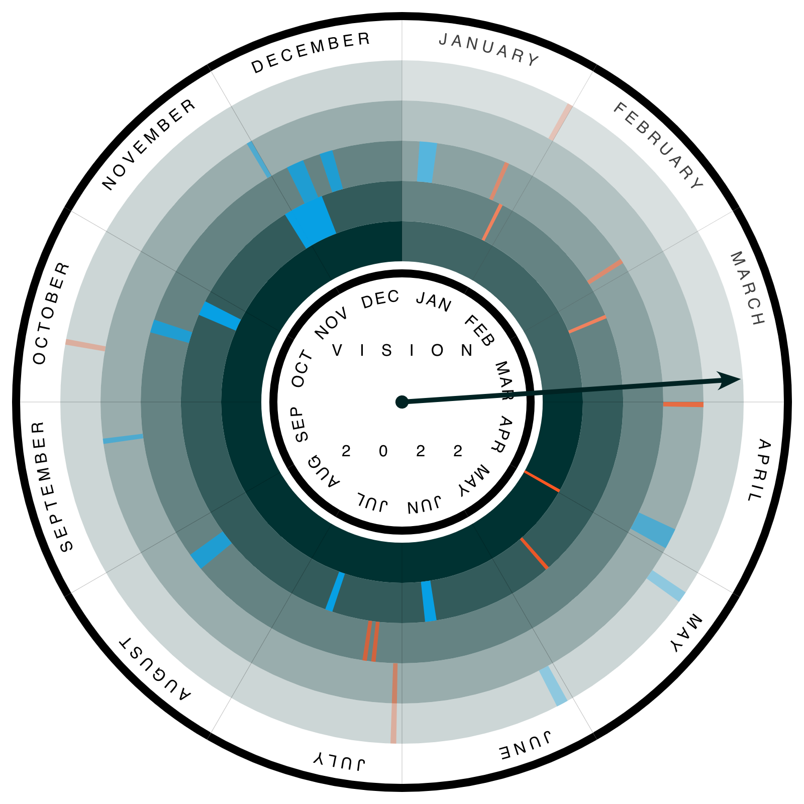

# Radial Clock



This is a lightweight JavaScript web component integrable with native JavaScript
and other web frameworks.

This plugin is written to keep track of annual events (particularly
conferences). Radial coordinate system is perfect to compress data and are a
nice transformation into smaller dimensions, especially with the imaginary axis.

## Include

```html
  <link rel='stylesheet' href='https://unpkg.com/radial-clock@1.0.0/dist/radial-clock.min.css'>
  ...
  <script src='https://d3js.org/d3.v4.min.js' text='application/js'></script>
  <script src='https://unpkg.com/radial-clock@1.0.0/dist/radial-clock.min.js' text='application/js'>
```

## Usage


```javascript
const data = [
  {
    "title": "ICCV",
    "fullForm": "International Conference on Computer Vision",
    "date": "27 October 2019",
    "url": "https://iccv2019.thecvf.com"
  }
];

const myClockOptions = {
  demarkMonths: true
};

const canvas = d3.select('svg');
const clock = new RadialClock(myClockOptions);
canvas.append(_ => clock.getClockNode(data));
```

[Documentation](https://radial-clock.surge.sh).
