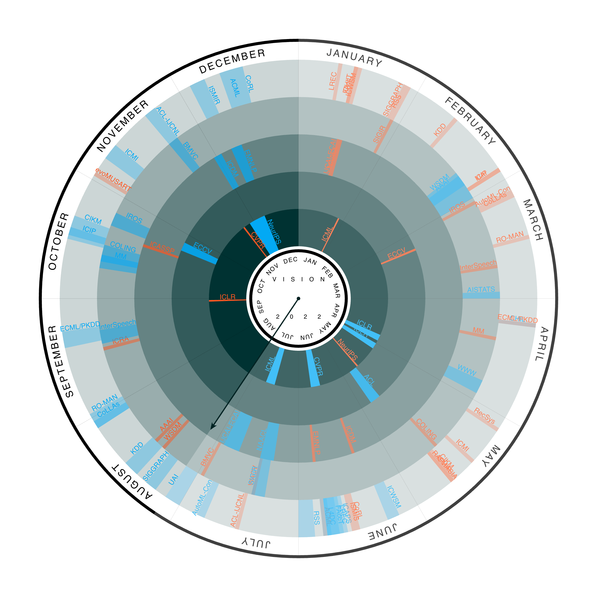

# Radial Clock

[](https://www.npmjs.com/package/radial-clock)

[](https://github.com/sujaltv/radial-clock/actions/workflows/npm_publish.yaml)



This is a lightweight JavaScript component written with D3.js and is integrable
with native JavaScript as well as web frameworks. There is a [list of items yet
to be done](TODO.md) for when time permits.

This plugin is written to keep track of annual events (*e.g.*,
[conferences](https://conferences.surge.sh)).

## Injection

```html
  ...
  <script src='https://d3js.org/d3.v4.min.js' text='application/js'></script>
  <script src='https://unpkg.com/radial-clock@%version%/dist/radial-clock.min.js' text='application/js'>
```

## Usage


```javascript
const data = [
  {
    "title": "ICCV",
    "fullForm": "International Conference on Computer Vision",
    "milestones": [
      {
        "type": "range",
        "from": "27 October 2019",
        "to": "2 November 2019"
      }
    ]
    "url": "https://iccv2019.thecvf.com"
  }
];

const myClockOptions = {
  demarkMonths: true
};

const canvas = d3.select('svg');
const clock = new RadialClock(myClockOptions);
canvas.append(_ => clock.getClockNode(data));
```
